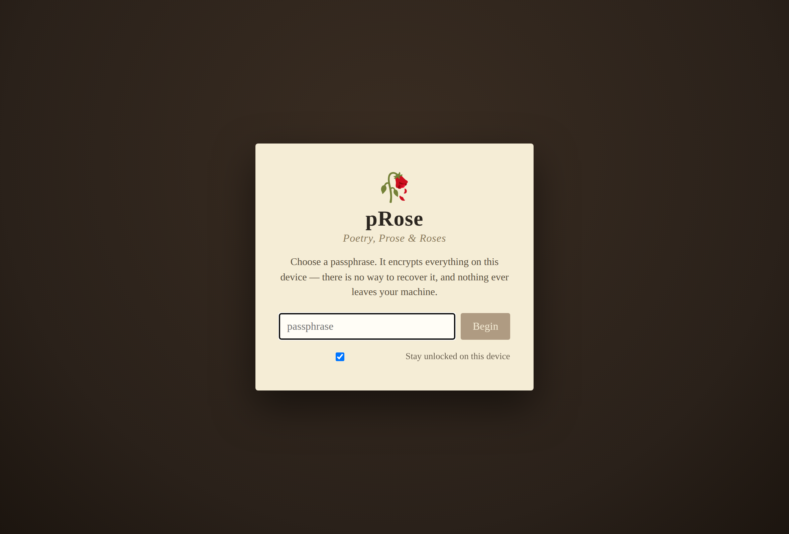
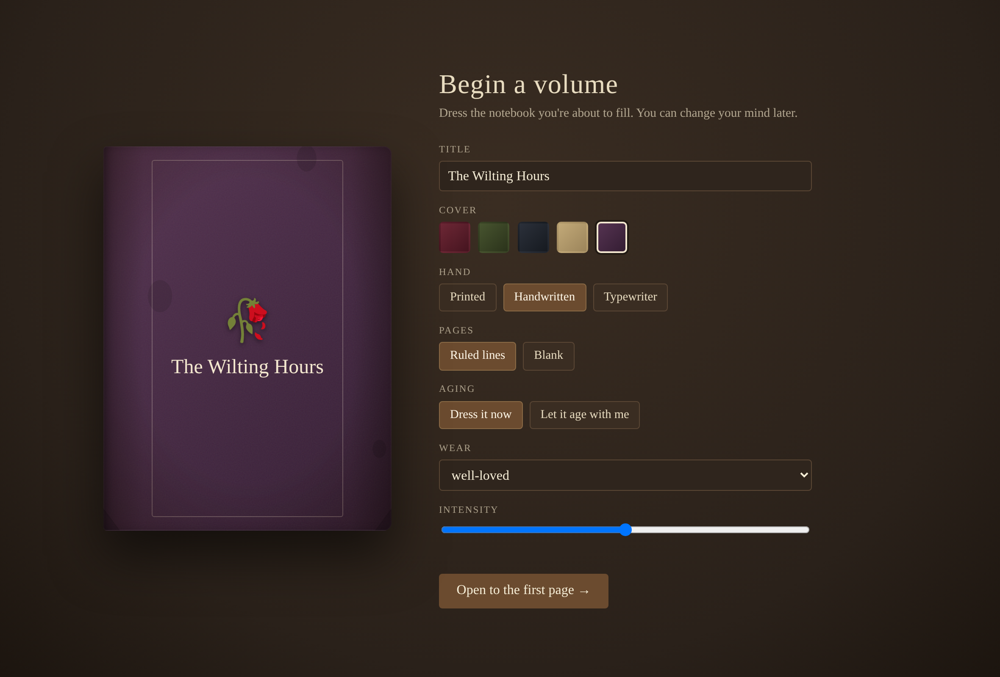
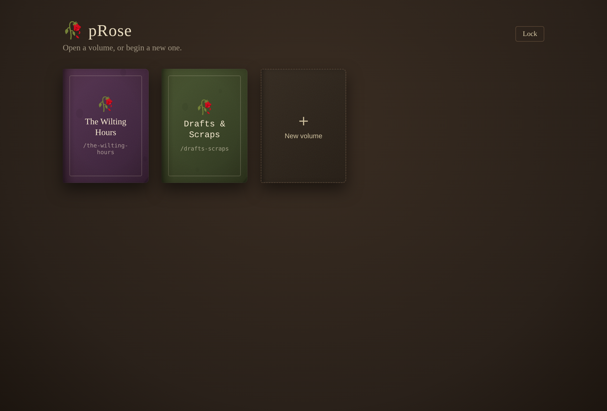
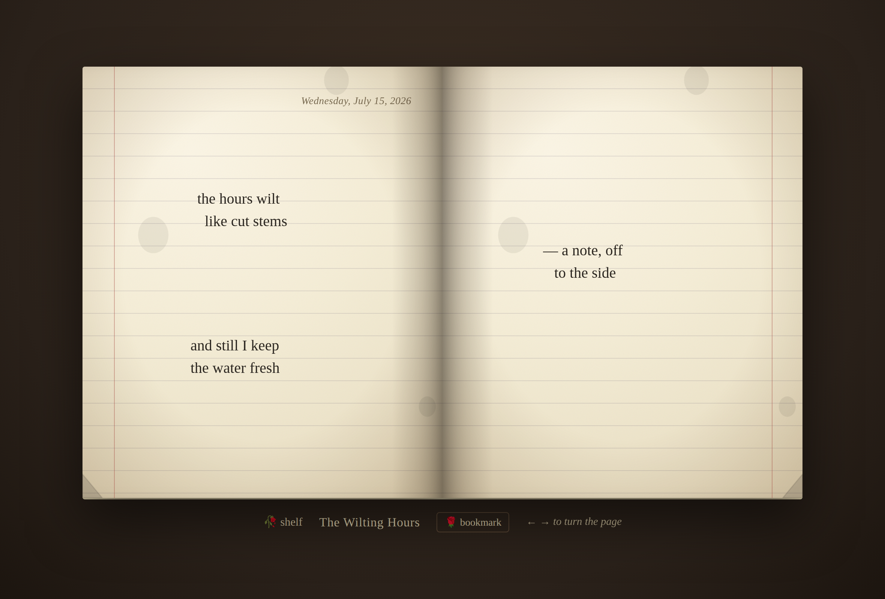
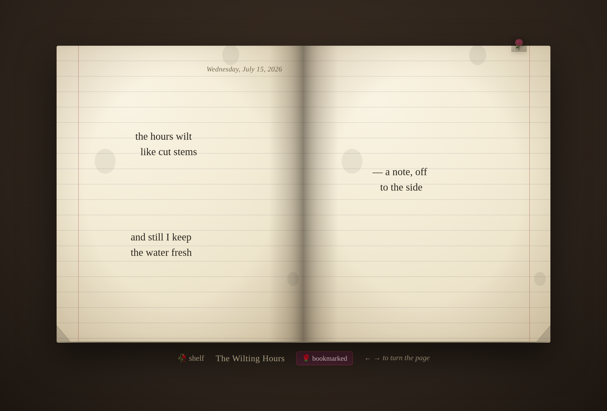

<p align="center">
  
</p>

<h1 align="center">pRose</h1>

<p align="center"><em>Poetry, Prose &amp; Roses — a private notebook for your poems.</em></p>

---

pRose is a journal for logging poems that looks and feels like a **real, battered
notebook**. A two-page spread you write across, pages that turn, paper that wears, a
rose bookmark you can tuck between the leaves. The date fills itself in. Everything is
encrypted on your machine and **nothing ever leaves it**.

The guiding principle: **it has to feel real** — and in poetry, *whitespace and line
breaks are the poem*, so pRose preserves them exactly, and lets you write **anywhere on
the page, in any order**.

---

## A look inside

### 1 · Begin

Choose a passphrase. It encrypts everything on this device — there's no server, no
account, and no way to recover it. Tick *stay unlocked* and reopening skips straight to
your shelf.

<p align="center"></p>

### 2 · Dress a volume

Before you write, dress the notebook: a title, one of five leather **covers**, a
**hand** (printed, handwritten, or typewriter), **ruled or blank** pages, and how it
should **age** — dress the wear yourself, or let it start brand-new and wear in as you
fill it. A live cover preview reacts to every choice.

<p align="center"></p>

### 3 · Your shelf

Every volume you keep, as a book on the shelf — its cover, its wear, its slug. Open one,
start a new one, or lock up. Each volume lives at its own URL (`#/v/the-wilting-hours`).

<p align="center"></p>

### 4 · Write anywhere

Click **any spot** on a page and start writing there — as many separate pieces as you
like, wherever you put them, in any order. Each block hugs its own text and keeps your
line breaks and indentation exactly.

<p align="center"></p>

### 5 · A rose bookmark

Tuck a **rose bookmark** into any page — it drapes from the top of the book on its
ribbon, and rides along until you lift it.

<p align="center"></p>

---

## What's inside

- **📖 A real notebook** — a two-page spread with a 3D page-turn (arrow keys or the edge
  arrows). Paging past the last day grows the book into a fresh, date-stamped day.
- **✍️ Write anywhere, in any order** — free-placed text blocks; whitespace preserved
  byte-for-byte.
- **🥀 Wear that feels earned** — spine crease, dog-eared corners, aged edges and paper
  foxing, generated procedurally from a per-notebook seed, so a volume looks *identical*
  every time you open it. Choose the wear, or let it accumulate with real use.
- **🌹 Rose bookmarks** — mark any page.
- **📚 A shelf of volumes** — one endless book or themed notebooks, each with its own
  look and slug. Delete from the shelf.
- **🔒 Private for real** — encrypted at rest with your passphrase (Web Crypto, AES-GCM).
  No server, no accounts. *Stay unlocked* is opt-in and cleared by **Lock**.

## Getting started

```bash
npm install
npm run dev
```

Open the printed URL (**http://localhost:5273/**), choose a passphrase, and begin.

```bash
npm run build     # type-check + production build
npm run preview   # serve the production build
```

## On the horizon

Designed and waiting: a dependable bundled handwriting font, drag-to-reflow of poems,
silent version history, a "loose pages" recovery drawer, off-grid QR/USB transfer, and
export (a page image, or a whole volume as a printable PDF).

## Tech

React + TypeScript + Vite. Local-only, encrypted, no backend — storage lives behind a
small backend-agnostic interface so a portable-file (USB) backend can slot in later.

---

<p align="center"><em>Private by design. Your notebook, and no one else's.</em></p>
